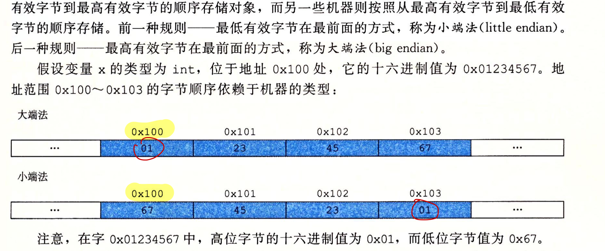

## Information Storage

* Rather than accessing individual bits in memory, most computers use `blocks of eight bits`, or bytes, as the `smallest addressable unit of memory`.
* A machinelevel program views memory as a very large array of bytes, referred to as virtual
memory.

## 2. Words

### 3. Addressing and Byte Ordering 寻址和字节顺序
* a multi-byte object is stored as a contiguous sequence of bytes, with the address of the object given by the smallest address of the bytes
used. 
  * int x (32位) 地址为 `&x = 0x100`，那么x的4个字节将被存储在内存的`0x100`,`0x101`,`0x102`和`0x103`位置

