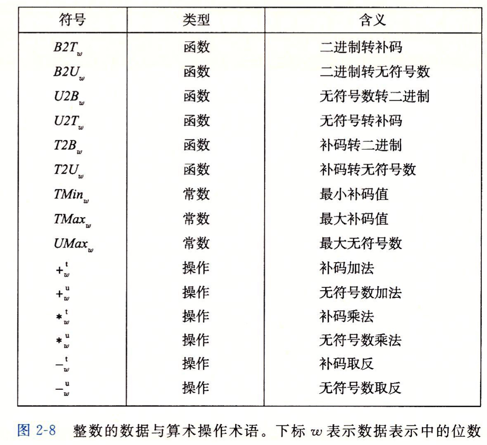

## 2.2 Integer Representations 整数表示

### 2.2.2 Unsigned Encodings (最简单）

### 2.2.3 Two's-Complement Encodings

* w位 The most significant bit xw-1is also called the *sign* bit. Its "weight" is -2w-1
* B2Tw is a mapping of bit patterns of length *w* to numbers between {-2w-1, 2w-1-1}
* 

